# 📊Retail sales dataset with Excel
## 🖇️Introduction
Dive into the basic functions in Excel. Using add into table, fliter, SUM and AVERAGE fuctions to process data. Demonstrate my ability to clean data.
## 📐Tool Used
Microsoft Excel (Data Cleaning and Analysis)
## 🔎Skills Demonstrate
### 📇Task 1 set into table, filter, SUM, AVERAGE.
1️⃣ In the sheet ‘retail_sales_dataset’ add all available data between columns A – H into a ‘table’.

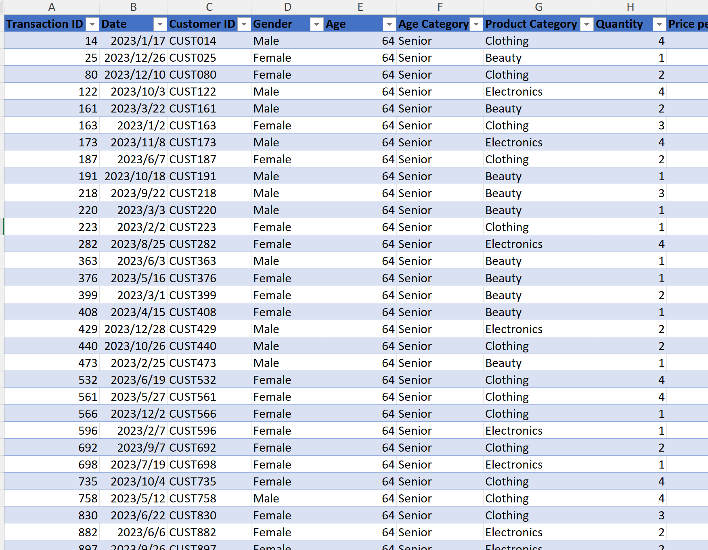

2️⃣ Using the ‘filter’ function, filter ‘Age’ to ‘largest to smallest’.

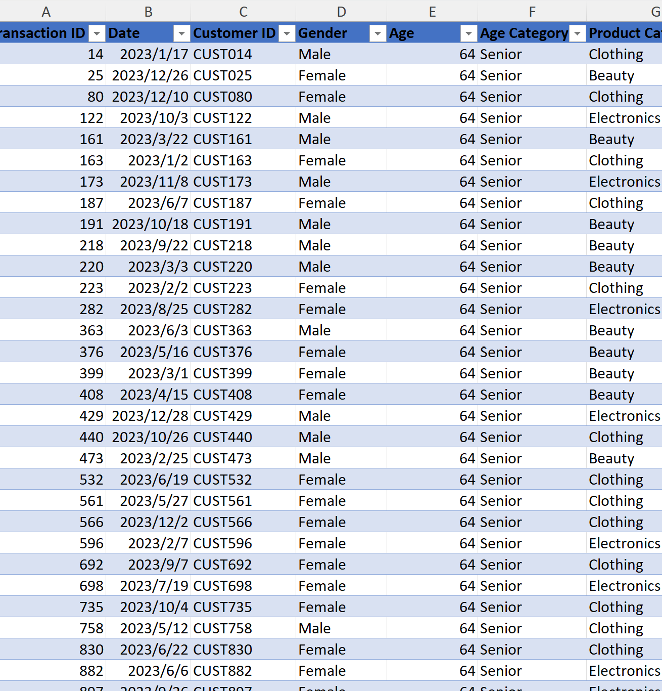

3️⃣	Using the ‘SUM’ function, show me the commission total in cell ‘P10’.

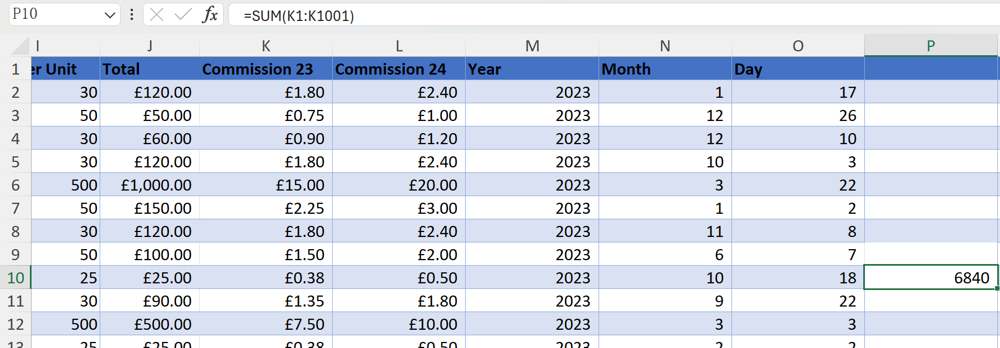

4️⃣	Using the ‘AVERAGE’ function, show me the average commission in cell ‘P11’.

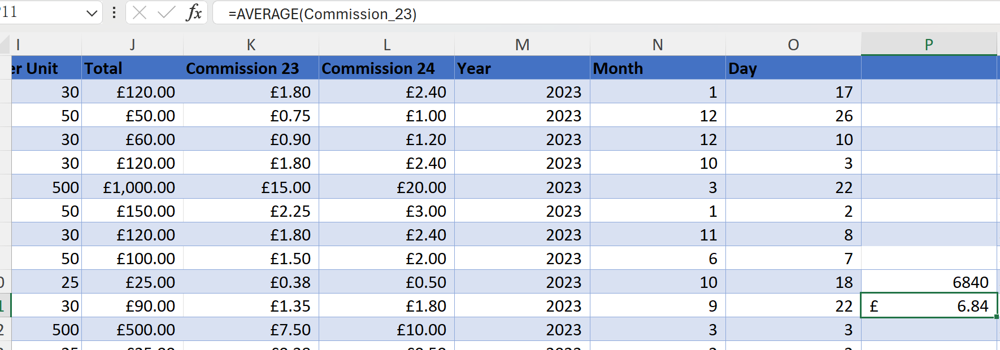

### 📇Task 2 fliter and sort, AVERAGE, MAX, conditional formatting.
1️⃣ Apply filter and sorting to show the best students in each subject.

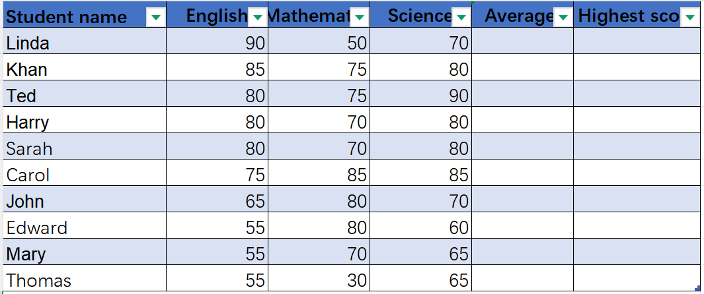
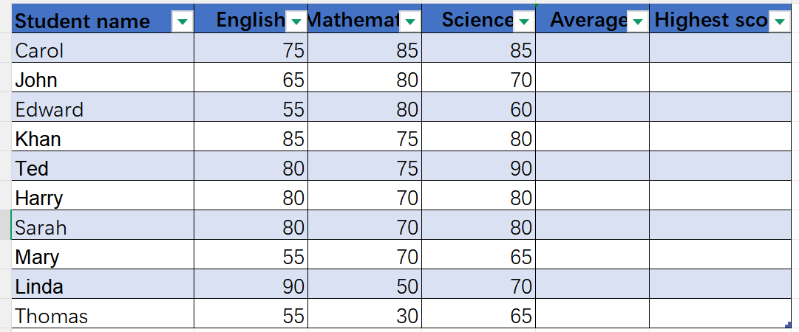
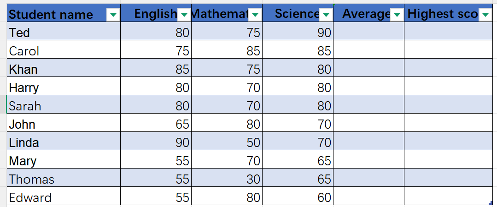

2️⃣ Calculate the average for all students and fill into Column E.

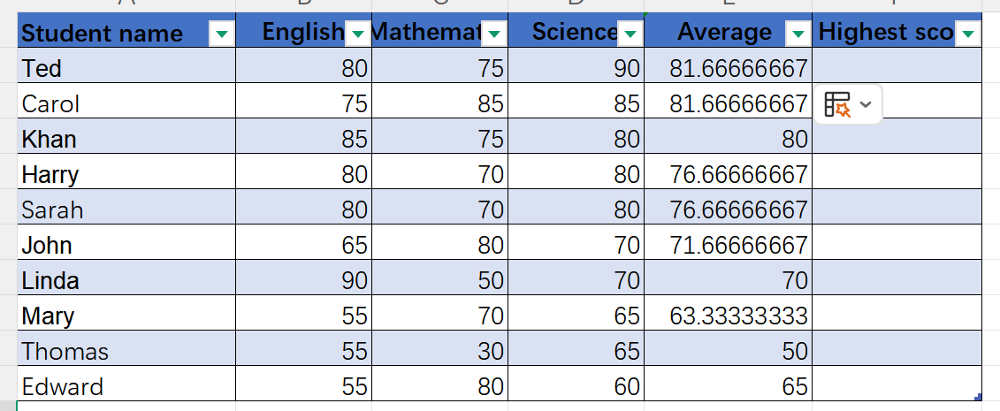

3️⃣ Using the =MAX function, tell me what the students highest score was in column F.

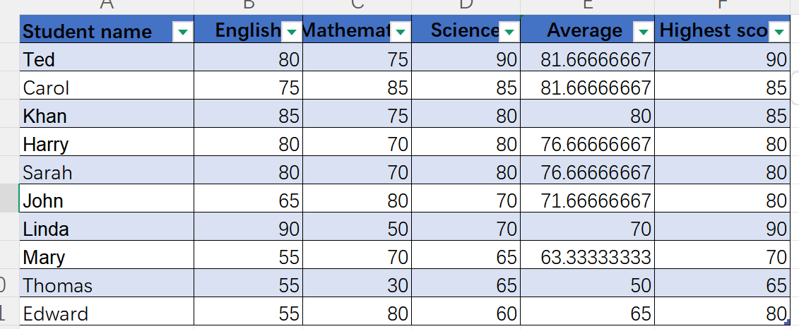

4️⃣ Apply filter and sorting to show the best student in this classroom by average.

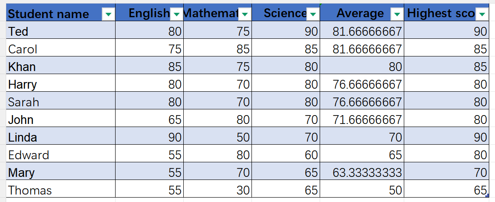

5️⃣ Apply filter and sorting to show the best student in this classroom by highest score.

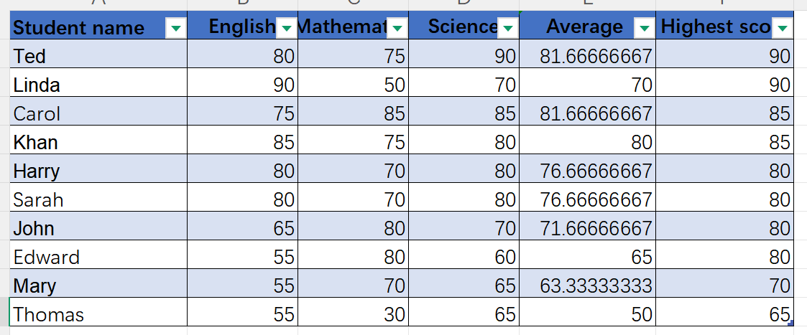

6️⃣ Use conditional formatting to clearly identify the highest and lowest average scores.

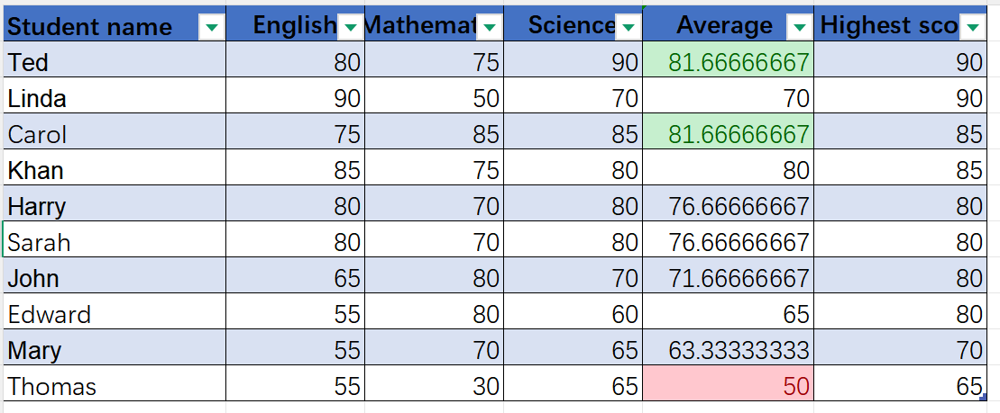

## Closing Thoughts
This project demostrates the basic funstions of Excel. Using set into table, fliter, sort, SUM, AVERAGE, conditional formatting and MAX to process data. By using these funcions I could develop raw data into useful data.
